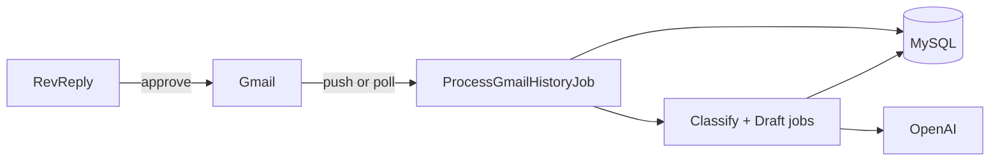

# RevReply

Connect Gmail, classify inbound mail, generate reply drafts, approve before send.

Repo: `gmail-auto-responder` · Laravel 11 + Next.js 14 + MySQL + Redis

1. Overview

Multi-user app. Each person connects one or more Gmail inboxes. Incoming mail gets classified and drafted by AI. Nothing sends until you approve it.

Flow

1. Register and sign in
2. Connect Gmail (one Google OAuth app for the whole product; multiple mailboxes per user)
3. New mail syncs into the DB
4. Backend classifies it and pulls out keywords
5. LLM writes a draft from your reply prompt
6. You open the thread, edit if needed, then Approve & send or Reject

Labels: interested, meeting_request, not_interested, unclear. Custom reply prompt per user. Draft saved in DB and Gmail when the API allows. Each user only sees their own mail.

2. What works

Tested on localhost.

UI

| Area | What it does |
|------|----------------|
| Overview | Account count, mail processed, replies sent, drafts waiting. Connected inboxes and recent activity. |
| Conversations | Thread list with pages. Filter by status (all / needs review / sent) or inbox. Ctrl+K search. Each row shows sender, subject, and which Gmail received it. |
| Thread detail | Message and labels on the left, draft on the right. Edit, approve & send, or reject. Status while classify/draft runs. |
| Mailboxes | Connect / disconnect Gmail. Sync one inbox or all. Status and message count per account. |
| Notifications | Header bell — draft ready, reply sent. Badge count. Mark all read. |
| Read / unread | ✕ not seen, ✓ seen. Toggle in the list; opening a thread marks it read. |
| Settings | Edit reply prompt. See LLM model in use. |
| Help | Steps to connect Gmail and add another mailbox. |

Backend

- Register / login (Sanctum bearer token)
- Gmail OAuth, multiple mailboxes per user
- Pub/Sub webhook or scheduler poll — same pipeline either way
- Queues: gmail-sync, ai
- OpenAI classify + draft (gpt-4o-mini default); keyword stub if API fails
- Thread search, filters, pagination, notifications (unread only)
- Idempotent sync, token refresh with Redis lock, watch renewal cron

Local dev: without Pub/Sub + ngrok you run in poll mode — scheduler hits Gmail every minute, Mailboxes page syncs in the background. Fine for testing.

3. Run locally

Need: PHP 8.2+, Composer, Node 18+, Docker

Repo layout

```
backend/           Laravel API
frontend/          Next.js dashboard
docker-compose.yml MySQL 8 + Redis 7
```

3.1 Start Docker

```bash
docker compose up -d
```

3.2 Backend setup

```bash
cd backend
cp .env.example .env
composer install
php artisan key:generate
php artisan migrate
```

Set in backend/.env:

```env
APP_URL=http://localhost:8000
FRONTEND_URL=http://localhost:3000

DB_CONNECTION=mysql
DB_HOST=127.0.0.1
DB_PORT=3306
DB_DATABASE=gmail_responder
DB_USERNAME=gmail
DB_PASSWORD=secret

QUEUE_CONNECTION=redis
CACHE_STORE=redis
REDIS_HOST=127.0.0.1
REDIS_PORT=6379

GOOGLE_CLIENT_ID=
GOOGLE_CLIENT_SECRET=
GOOGLE_REDIRECT_URI=http://localhost:8000/api/gmail/callback
GOOGLE_PUBSUB_TOPIC=projects/your-project/topics/gmail-push

LLM_DRIVER=openai
OPENAI_API_KEY=sk-your-key-here
OPENAI_MODEL=gpt-4o-mini
```

Google OAuth

1. Google Cloud Console → project → enable Gmail API
2. OAuth consent screen → External → add test users (required in Testing mode)
3. Credentials → OAuth client ID → Web application
4. Redirect URI: http://localhost:8000/api/gmail/callback
5. Copy Client ID + secret into .env

Pub/Sub is optional locally — leave the topic placeholder and polling handles sync.

OpenAI key from platform.openai.com — required for real classify/draft.

3.3 Frontend setup

```bash
cd frontend
cp .env.local.example .env.local
npm install
```

```env
NEXT_PUBLIC_API_URL=http://localhost:8000/api
```

3.4 Run (4 terminals)

```bash
cd backend && php artisan serve
cd backend && php artisan schedule:work
cd backend && php artisan queue:work redis --queue=gmail-sync,ai
cd frontend && npm run dev
```

| Process | Why |
|---------|-----|
| serve | API + OAuth callback |
| schedule:work | Poll Gmail + run pending classify/draft |
| queue:work | Required — without this, drafts never show up |
| npm run dev | UI at http://localhost:3000 |

3.5 Smoke test

Register → Mailboxes → Connect Gmail → email yourself something like "Interested in a demo, can we meet Tuesday?" → wait ~30–60s or Sync now → Conversations → approve draft.

Stuck? Check queue worker first, then OAuth test user in GCP, then backend/storage/logs/laravel.log.

4. How it works

Tables, sync, queues — one system.

4.1 Tables

```
users                   reply_prompt
gmail_accounts          tokens, history cursor, watch expiry, status
gmail_threads           subject, snippet, notification_state (0 unread / 1 read)
gmail_messages          body, sender, received_at
classifications         label, keywords, confidence
draft_replies           body, status
processed_notifications Pub/Sub dedup (not in UI)
```

users → gmail_accounts → gmail_threads → gmail_messages. One classification + one draft per inbound message. Scoped by user_id.

4.2 Flow



Mail arrives → saved to DB → classified → draft written → user approves or rejects.

4.3 Push vs poll

Prod: Pub/Sub set → watch on connect → Gmail POSTs /api/webhooks/gmail/pubsub → job queued.

Local: no Pub/Sub → gmail:poll every minute + UI sync on Mailboxes.

Same tables and jobs. Different trigger.

4.4 Queues

```bash
php artisan queue:work redis --queue=gmail-sync,ai
```

gmail-sync — fetch mail. ai — classify + draft.

Sync: 5 retries. AI: 3 retries. Failures → failed_jobs.

Commands: gmail:poll · gmail:renew-watches · gmail:process-pending · gmail:backfill-drafts

4.5 When things break

Duplicate webhook → skip. Token revoked → reconnect on Mailboxes. History ID expired → mailbox error. Gmail draft API fails → draft still in DB. OpenAI fails → stub, pipeline continues.

GET /up · logs in backend/storage/logs/laravel.log

5. Upgrade plan (published version)

Same foundation in prod: one OAuth app, multi-mailbox, queues, human approval before every send. What changes is ingress, ops, and polish.

5.1 Now vs later

| Area | This repo | Published |
|------|-----------|-----------|
| Mail ingress | Poll + optional Pub/Sub | Pub/Sub only, no browser sync |
| Webhook | Payload check | JWT on every request |
| API | Sanctum | + rate limits |
| Ops | log file, /up, failed_jobs | Horizon, Sentry, trace IDs, alerts |
| OAuth | Testing mode | Published app, any user |
| Secrets | .env | Secrets manager |
| Workers | 4 manual terminals | Supervisor/systemd, auto-restart |
| Notifications | In-app bell | + email for reconnect, draft ready |
| Audit | Draft status in DB | Full log of who approved/edited/rejected |

5.2 Production work

- Webhook acks fast, all Gmail/LLM work in workers
- Separate worker pools for sync vs AI; scale on queue depth
- Per-mailbox rate limit + sync lock (one OAuth app = shared Google quota)
- Auto-resync when history ID expires; circuit-break bad mailboxes
- Remove sync-all polling from frontend in prod
- Onboarding flow, reconnect banners, optional mailbox nicknames
- Load test: ~100 concurrent webhooks, no duplicate drafts

5.3 Launch checklist

- [ ] Google OAuth published (not Testing)
- [ ] Pub/Sub push + JWT on production URL
- [ ] Secrets manager, not plain .env on servers
- [ ] Workers + scheduler auto-restart
- [ ] Health checks and alerting wired up
- [ ] php artisan migrate on deploy (includes notification_state)

Copy backend/.env.example and frontend/.env.local.example, run the four processes, connect Gmail, open Conversations. Queue worker is the usual culprit when nothing happens.
